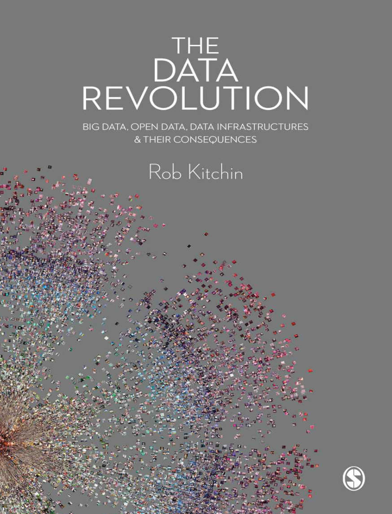
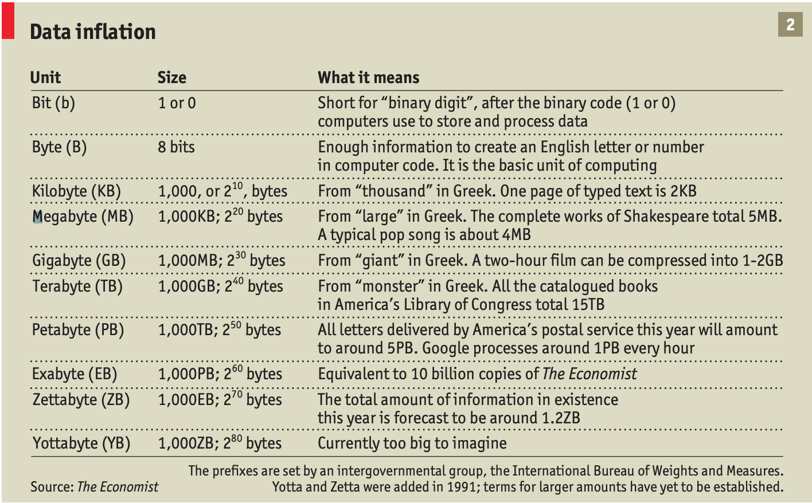
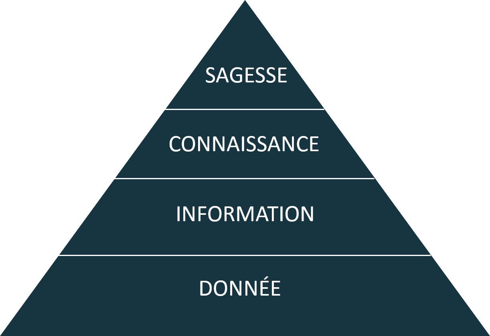
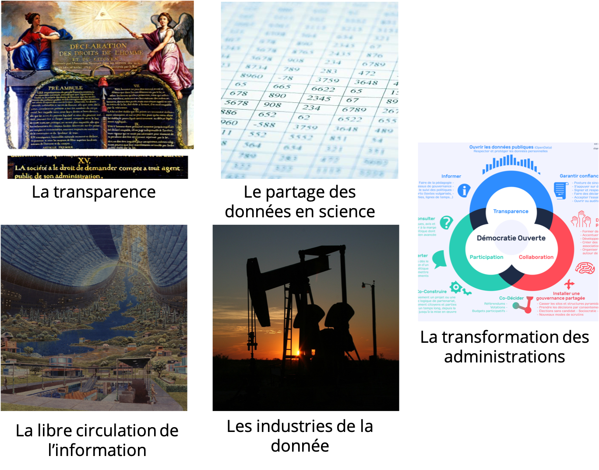

layout: true

`r paste0("
", params$event, " 

")`

---
class: center, middle

Ces slides en ligne :
`r paste0("http://datactivist.coop/", params$slug)`

Sources : `r paste0("https://github.com/datactivist/", params$slug)`

Les productions de Datactivist sont librement réutilisables selon les
termes de la licence [Creative Commons 4.0
BY-SA](https://creativecommons.org/licenses/by-sa/4.0/legalcode.fr).

   

---
### .red[Au programme]

1. Dessine moi une donnée

2. La mise en données du monde

3. Le cadre juridique des données

4. Ceux qui mangent les données : algorithmes, sciences de la données et intelligence artificielle

---

class:center,inverse, middle 

# Dessine moi une donnée

.reduite[

]

---

### Une définition des données

.left-column[

]
 
.right-column[
 
> *Les données sont généralement comprises comme étant la matière première produite dans l'abstraction du monde en catégories, mesures et autres formes de représentation - nombres, caractères, symboles, images, sons, ondes électromagnétiques, bits - qui constituent les fondations sur lesquelles l'information et le savoir sont créés.*
]

---

### Les données, la base de l'informatique

L'informatique consiste dans le traitement de l'information, ou de la donnée. La naissance de l'informatique est le point de départ d'un déluge de données. Le volume des données créées et traitées ne cesse de croître en même temps que les capacités de calcul des ordinateurs. 

.center[
.reduite2[

]
]

---

### La pyramide DIK

Attribuée à [Russell Ackoff](http://en.wikipedia.org/wiki/Russell_L._Ackoff) en 1989, elle signifie que :
.pull-left[

]

.pull-right[

- la **.red[donnée]** est la matière "brute" de l'information conçue plutôt pour des machines
- **.red[l'information]** sont des données qui ont été interprétées pour dégager du sens pour des humains
- en donnant du sens à de l'information, on obtient de la **.red[connaissance]**
- en donnant du sens à la connaissance on obtient de la **.red[sagesse]** (ou compétence).]

---

### Un peu de sémantique 

**Latin : dare (donner) > datum (donné) > data (donnés)**

*Ce qui est évident, va de soi, est accepté sans discussion.*

 

--

**Data ou capta ?**

> Techniquement, ce que nous nous appelons "donnée" est en réalité **"capturé"** (du latin "capere", qui signifie "prendre") ; les *capta* sont les unités de données qui ont été sélectionnées et collectées parmi l'ensemble de toutes les données possibles.

[Kitchin, *The Data Revolution*, 2014](https://books.google.fr/books?hl=fr&lr=&id=GfOICwAAQBAJ&oi=fnd&pg=PP1&dq=kitchin+data+revolution&ots=pcyfMTZh-V&sig=dQyPTL3AIN_4RdWvtBFw4VjdAa4#v=onepage&q=kitchin%20data%20revolution&f=false)

---

class:center,inverse,middle 

# La mise en données du monde

---

### Le censeur à Rome, ancêtre de la statistique

.center[.reduite3[]]

.footnote[Source : *Asterix chez les pictes*, © Albert René 2013]

???

Premiers recensements connus à Babylone 3800 ans avant notre ère

---

### La statistique : outil de gouvernement et de preuve

La statistique est à la fois :
* **outil de gouvernement** (_Statistik_ - 18e siècle)

* **outil de preuve** (_statistics_ - 19e siècle)

--

.left-column.reduite3[

]

.right-column[
> Comment comprendre qu’un même mot, statistique, évoque pour les uns la simple quantification (…), et pour d’autres l’idée de grands nombres et de régularités tendancielles appuyées sur le calcul des probabilités (…) ?
]

???

La Statistik allemande du 18e siècle était une description organisée de l’État, descriptive, peu quantitative, rassemblant les savoirs utiles au Prince.

La statistique inférentielle est une branche spécialisée des mathématiques, utilisée pour induire, tester et généraliser des connaissances à partir de faits observés (calcul des probabilités, phénomènes aléatoires ou stochastiques…).

Avant le 19e siècle, la légitimité sociale des statisticiens ne provient donc pas de méthodologies formelles encore inexistantes mais de leur capacité à s’insérer dans des projets socio-politiques plus vastes en s’y affirmant comme des points de passage obligés.

---

### "Datafication" : la mise en données du monde

> "L'immense gisement de données numériques découle de la capacité à paramétrer des aspects du monde et de la vie humaine qui n'avaient encore jamais été quantifiés. On peut qualifier ce processus de **« mise en données » (datafication)**. 

> (…) La mise en données désigne autre chose que la numérisation, laquelle consiste à traduire un contenu analogique - texte, film, photographie - en une séquence de 1 et de 0 lisible par un ordinateur. Elle se réfère à une action bien plus vaste, et aux implications encore insoupçonnées : **numériser non plus des documents, mais tous les aspects de la vie**."

.footnote[Kenneth Cukier (2013), "[Mise en données du monde, le déluge numérique](https://www.monde-diplomatique.fr/2013/07/CUKIER/49318)", *Le Monde diplomatique*]

---
Class: middle, center

### La mise en données du monde

- **Concrètement, aujourd'hui, quels aspects de votre vie sont mis en données ?**

--

- Recherches internet .red[(cookies)], pratiques sportives .red[(montres connectées)], consommation énergie .red[(compteurs connectés)], régime alimentaire .red[(appli type Yuka)], trajets dans les transports en commun .red[(Pass Navigo)]...

- Cette mise en donnée est rendue possible par le développement de .red[**capteurs**] qui viennent collecter et agréger ces données.

--

- La question devient peut-être, *quels aspects de votre vie ne sont pas (encore) mis en données ?*

---
### Exemple : les données de bornage des téléphones

???

"We spotted a senior official at the Department of Defense walking through the Women’s March, beginning on the National Mall and moving past the Smithsonian National Museum of American History that afternoon. His wife was also on the mall that day, something we discovered after tracking him to his home in Virginia. Her phone was also beaming out location data, along with the phones of several neighbors."

---

### Le nouveau positivisme des données

- Attention, les données, même provenant de sources officielles, ne sont pas pour autant neutres, irréprochables ou porteuses de "LA" vérité

.center[]
.footnote[Dilbert © Scott Adams]

- **Avez-vous des exemples de données officielles pouvant faire l'objet de critiques ?**

---

class:center,inverse, middle 

# Open data et cadre juridique

---

### 1978 : La loi CADA, vers le "droit de savoir"
* Le fondement : la .red[Déclaration des Droits de l'Homme et du Citoyen de 1789] dans son article 15, "la Société a le droit de demander compte à tout Agent public de son administration." 

* Le droit d'accès des citoyens à l'information publique émerge en **1978 avec la loi dite CADA** du nom de la Commission d'Accès aux Documents Administratifs. 

* La France était le .red[3e pays au monde] après la Suède et les Etats-Unis avec le Freedom of Information Act (FOIA) en 1966 à accorder un "droit de savoir" avec pour but d'améliorer les relations entre le public et l'administration.

.footnote[Il faudrait maintenant désigner la loi comme le Code des relations entre le public et l'administration (CRPA) qui, dans son [livre 3](https://www.legifrance.gouv.fr/affichCode.do;jsessionid=BDF8EC0BD562E214CCD9A5ADD435D690.tplgfr42s_1?idSectionTA=LEGISCTA000031367685&cidTexte=LEGITEXT000031366350&dateTexte=20190429), codifie le droit d'accès et de réutilisation mais il est encore moins connu que la loi CADA…]

---

### Du droit d'accès à l'open data

**Les "bases de données" : des documents administratifs ?**

Le guide CADA-CNIL rappelle la définition des "bases de données"

> On entend par base de données un recueil d'œuvres, de données ou d'autres éléments indépendants, disposés de manière systématique ou méthodique, et individuellement accessibles par des moyens électroniques ou par tout autre moyen (art L112-3 du code de la propriété intellectuelle)

---

### Loi pour une République Numérique : l'ouverture des données par défaut

.pull-left[
La [loi pour une République  Numérique](https://www.legifrance.gouv.fr/affichTexte.do;jsessionid=B5632993E54F7CCC2606664B64CDF612.tpdila11v_1?cidTexte=JORFTEXT000033202746&categorieLien=id) impose un principe d'.red[**ouverture des données par principe**] qui ne fait pas l'objet de sanctions à toutes les administrations, les entreprises délégataires d'une mission de service public et les .red[**collectivités locales de plus de 3500 habitants et 50 agents**]. 
]

.pull-right[

]

---
## .red[Les 8 principes] de l'open data

1/ **Des données complètes** : toutes les données publiques doivent être rendues disponibles dans les limites légales liées à la vie privée ou la sécurité.

2/ **Des données primaires** : les données ouvertes sont telles que collectées à la source, non-agrégées avec le plus haut niveau de granularité

3/ **Des données fraiches (*timely*)** : les données doivent être disponibles dès qu'elles sont produites

4/ **Des données accessibles** : les données doivent être utilisables par le plus grand nombre d’usagers potentiels

---

## .red[Les 8 principes] de l'open data

5/ **Des données exploitables par les machines** : Les données peuvent être traitées automatiquement par les machines

6/ **Des données non discriminatoires** : Elles peuvent être utilisées par tous sans réclamer un enregistrement préalable

7/ **Des données dans un format ouvert** : Ce format ne doit pas être la propriété d'une organisation en particulier (.xls) et doit être gouverné par ses usagers (exemple : CSV)

8/ **Des données dans une licence ouverte** : Idéalement dans le domaine public sinon dans une licence conforme à l'[Open Definition](https://opendefinition.org/od/2.1/en/) : Licence Ouverte (CC-BY) ou ODBL (CC-BY-SA)

---

### [.red[Les multiples facettes]](https://books.openedition.org/cdf/5005?lang=fr)  de l'open data

.reduite.center[]

---

### Ouverture par défaut... de toutes les données ?

Les données à caractère personnel sont évidemment exclues. Elles sont même encadrées par un règlement spécifique : Le règlement général sur la protection des données (RGPD).

.pull-left[
Adopté à la mi-avril 2016 après 4 années de débat, 3 objectifs :
* Renforcer les droits des personnes.
* Responsabiliser les acteurs traitant des données personnelles des résidents européens.
* Crédibiliser la régulation.

]

.pull-right[

]
---

### .red[Le RGPD] : crédibiliser la régulation

* ⚖️ Les autorités de protection peuvent notamment : limiter temporairement ou définitivement un traitement, suspendre les flux de données, ordonner la rectification, la limitation ou l'effacement des données

* 🔫 Amendes : jusqu'à 10 ou 20 millions d’euros, ou, dans le cas d’une entreprise, de 2% jusqu’à 4% du chiffre d'affaires annuel mondial, le montant le plus élevé étant retenu.

* 🇪🇺 Sanction conjointement adoptée entre l’ensemble des autorités concernées, donc potentiellement pour le territoire de l’UE

---

### .red[Le RGPD] : Renforcer les droits des personnes

.pull-left[

**Transparence et consentement explicite** : plus de lisibilité sur ce
qui est fait de mes données (preuve de consentement explicite dans des
termes clairs) et j'exerce mes droits plus facilement (droit d'accès,
droit de rectification, droit à l'oubli).]

---

### .red[Le RGPD] : Renforcer les droits des personnes

.pull-left[

**Protection des mineurs** : Les services en ligne doivent obtenir le
consentement des parents des mineurs de moins de 16 ans avant leur
inscription.] .pull-right[

**Guichet unique** : En cas de problème, je m'adresse à l'autorité de
protection des données de mon pays, quelque soit le lieu d'implantation
de l'entreprise qui traite mes données.] .footnote[Source :
[CNIL](https://www.cnil.fr/fr/plus-de-droits-pour-vos-donnees)]

---

### .red[Le RGPD] : Renforcer les droits des personnes

.pull-left[

**Sanctions renforcées** : En cas de violation de mes droits,
l'entreprise responsable encourt une sanction pouvant s'élever à 4% de
son chiffre d'affaires mondial.] .pull-right[

**Droit à l'oubli** : Je peux demander à ce qu'un lien soit déréférencé
d'un moteur de recherche ou qu'une information soit supprimée s'ils
portent atteinte à ma vie privée.] .footnote[Source :
[CNIL](https://www.cnil.fr/fr/plus-de-droits-pour-vos-donnees)]

---

### .red[Le RGPD] : Responsabiliser les acteurs

-   **Privacy by design** : protection des données personnelles dès la
    conception du produit et par défaut

-   **Minimisation** : limiter la quantité de données personnelles dès
    le départ

-   **Accountability** : mettre en place des mesures de protection des
    données et démontrer cette conformité à tout moment

-   Fin des obligations déclaratives sauf si risque accru pour la vie
    privée

---

class:center,inverse, middle 

# Ceux qui mangent les données

.reduite[

]

---
### L'explosion des données ? 

La conjonction de deux mouvements :

- la hausse exponentielle de la capacité à stocker et traiter des données numériques 
- la hausse exponentielle de la volonté de collecter des données numériques

Il en résulte ce qui a été appelé le "big data":

- se définit par les trois V (selon la société Gartner) : "volume", "velocity", "variety" (+ "veracity" ?)
- Kitchin ajoute l'exhaustivité, la résolution, la *scalability*

---
### L'explosion des données ? 

[.reduite[.center[]]](http://visual.ly/infographic-about-computers)

???

Loi de Moore

---
### L'explosion des données ? 

1996... 
[.reduite[.center[]]](https://twitter.com/alicemazzy/status/655306196128280576?ref_src=twsrc%5Etfw)

---

### L'explosion des données ? 

2016... 

.reduite[.center[]]

---
### De la statistique à la *data science* 

- la statistique est une relativement vieille science (développement au 18e siècle), pour aider les États (_Statistik_) à compter (les contribuables, les soldats potentiels...) mais aussi des entreprises privées (au départ, les assureurs => actuariat)

- la statistique repose sur une branche des mathématiques, les probabilités, qui émerge au milieu du 17e siècle, avec Pascal et Fermat notamment.

- c'est pourquoi la statistique est une discipline pratiquée par des mathématiciens, avec une importante formalisation mathématique.

- la pratique de la statistique recouvre une forte dimension théorique : on part de problèmes théoriques, et de données d'illustrations, plutôt que de données et de problèmes réels. 

---
## Au commencement était la statistique

> I keep saying the sexy job in the next ten years will be statisticians. People think I’m joking, but who would’ve guessed that computer engineers would’ve been the sexy job of the 1990s?

> *Je dis tout le temps que le métier sexy dans les dix ans à venir sera celui de statisticien. Les gens pensent que je plaisante, mais qui aurait pu deviner que les ingénieurs informatiques auraient été le métier sexy des années 1990 ?*

Hal Varian (économiste en chef, Google), _The McKinsey Quarterly_, January 2009

---
## Data science is the new statistics?

> I think data-scientist is a sexed up term for a statistician

> *Je pense que data scientist est un terme sexy pour dire statisticien*

[Nate Silver](http://www.statisticsviews.com/details/feature/5133141/Nate-Silver-What-I-need-from-statisticians.html)

---
## Data science is the new statistics?

[.reduite[.center[]]](http://www.prooffreader.com/2016/09/battle-of-data-science-venn-diagrams.html)

---
## Data science is the new statistics?

La data science, comparativement à la statistique "traditionnelle", est un métier de praticien, presque de bidouilleur : elle nécessite des compétences mathématiques et statistiques, certes, mais aussi une compétence "métier" (compréhension du domaine d'application) et une solide maîtrise de l'informatique. 

---

### Changement de paradigme : le *machine learning*

- statistique classique : les problèmes doivent pouvoir être résolus de manière analytique, sans puissance de calcul particulière (d'où le succès du fréquentisme)

- le développement de la puissance de calcul permet de résoudre des problèmes statistiques par la simulation ([MCMC](https://fr.wikipedia.org/wiki/M%C3%A9thode_de_Monte-Carlo_par_cha%C3%AEnes_de_Markov)) : on n'a pas besoin de connaître la solution mathématique, il "suffit" de faire de nombreuses simulations aléatoires.

---
### Changement de paradigme : le *machine learning*

- Fondamentalement, modélisation et machine learning ne sont pas différents, du point de vue d'un statisticien : modéliser un $Y$ en fonction d'un vecteur de $X_i$
- Une des différences principales toutefois : veut-on *prévoir* ou *comprendre/analyser* ?
- Et donc : peut-on, veut-on interpréter les coefficients ?

En pratique : le machine learning porte sur des données plus complexes que la modélisation traditionnelle, avec souvent beaucoup de valeurs manquantes.

---

### Changement de paradigme : le *machine learning*

Apprentissage supervisé vs non-supervisé

.pull-left[

]

.pull-right[

]

---

### Ce qu'on appelle aujourd'hui l'intelligence artificielle

Un terme ambigu et recouvrant des réalités socio-techniques très diverses, de la fonction Excel au modèle GPT-3 ou Dall-E en passant par des Mechanical Turks...

Une classe de modèles importante : le *deep learning*

.reduite[]

---

### Algorithmes, IA, code source 

- Un **algorithme** "est la description d'une suite d'étapes permettant d'obtenir un résultat à partir d'éléments fournis en entrée" ([CNIL](https://www.cnil.fr/fr/definition/algorithme)).
- Cet algorithme est considéré comme un **algorithme public** (au sens de la loi pour République numérique) lorsqu'il est utilisé dans le cadre d'une mission de service public, en particuluer pour prendre une décision administrative individuelle.
- Un algorithme peut aller de modèles procéduraux très simples à des modèles d'IA très complexes -- avec un rapport variable entre importance des règles (calcul de l'impôt) et importance des données d'entraînement (détection de la fraude fiscale) (modèles procéduraux vs modèles auto-apprenants).
- Le **code source** désigne la manière dont un algorithme est traduit dans une suite concrète d'instructions informatiques, dans un langage informatique donné.

S'agissant de modèles auto-apprenants/de *machine learning* supervisé, **l'ouverture du code source ne suffit pas à sa transparence** : il est très dépendant des données d'entraînement en amont, et se caractérise par ses *poids* (le modèle entraîné) en aval.

---

class: inverse, center, middle

# .red[Temps de questions-réponses]

## Posez vos questions dans le chat !

---
class: inverse, center, middle

# Merci !

Contact : [joel@datactivist.coop](mailto:joel@datactivist.coop)

