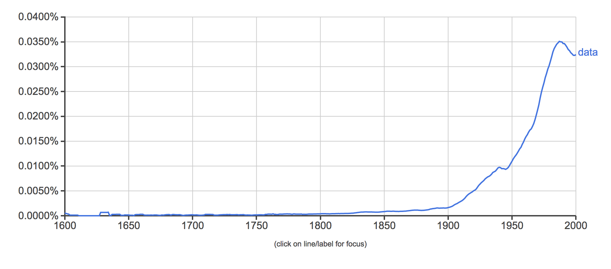
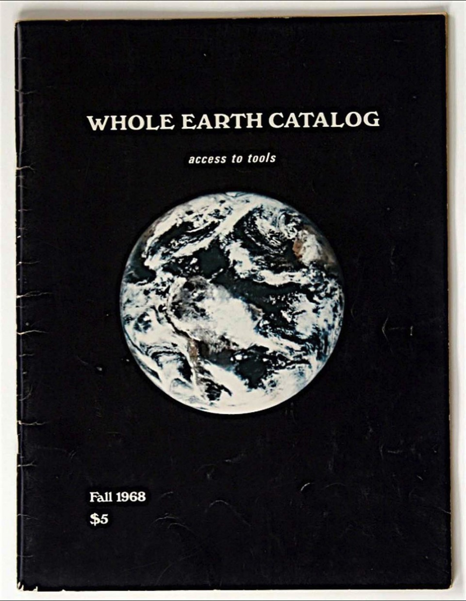
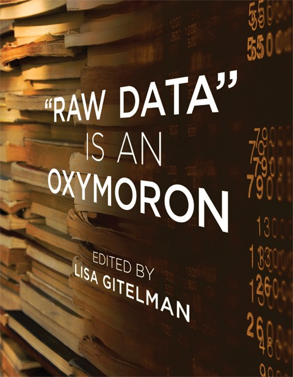
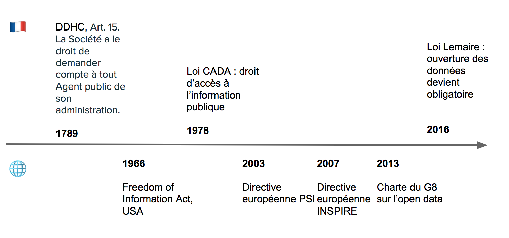
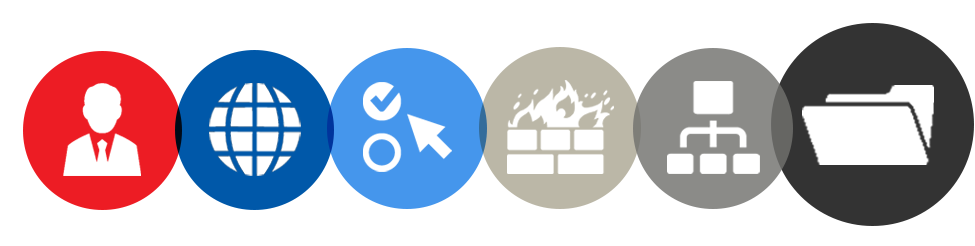
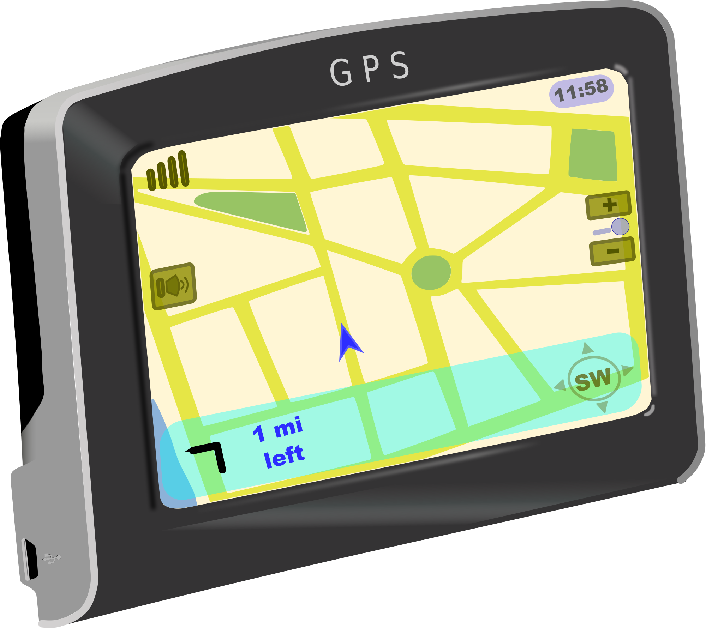

layout: true

`r paste0("
", params$event, " 

")`

---
class: center, middle

Ces slides en ligne :
`r paste0("http://datactivist.coop/", params$slug)`

Sources : `r paste0("https://github.com/datactivist/", params$slug)`

Les productions de Datactivist sont librement réutilisables selon les
termes de la licence [Creative Commons 4.0
BY-SA](https://creativecommons.org/licenses/by-sa/4.0/legalcode.fr).

   

---
### Plan de la présentation participante

1. Qu'est-ce qu'une donnée ?

2. Mise en données du monde

3. Open data et cadre juridique

4. Ceux qui mangent les données : aglorithmes, sciences de la données et intelligence articifielle

---
class: middle, center
## Échauffement :
### 3 minutes, 5 données

Vous avez 5 minutes

Vous devez trouver 5 données dans votre environnement immédiat

.footnote[[source](http://infolabs.io/5-minutes-20-donnees)]

---

class:center,inverse, middle 

# Qu'est-ce qu'une donnée ?

---

### FYI Plan Qu'est-ce qu'une donnée ?

Ne pas tenir compte des slides d'après (pas encore dans l'ordre)

- Pyramide
- Informatique
- Kitchin
- Capta
- Excel

### Notions

- Data

---

class:center,inverse, middle 

# La mise en données du monde

---

### La mise en données du monde

Ne pas tenir compte des slides d'après (pas encore dans l'ordre)

- Censeur
- Dataification
- Derosières
- Positivisme ?

### Notions

- Données et statsitique
- Data

---

class:center,inverse, middle 

# Open data et cadre juridique

---

### Open data et cadre juridique

Ne pas tenir compte des slides d'après (pas encore dans l'ordre)

- Droit d'accès
- Open data
- Cadre juridique
- RGPD

### Notions

- Open data
- RGPD

---

class:center,inverse, middle 

# Ceux qui mangent les données : aglorithmes, sciences de la données et intelligence articifielle

---

### Ceux qui mangent les données : aglorithmes, sciences de la données et intelligence articifielle

Ne pas tenir compte des slides d'après (pas encore dans l'ordre)

- Statistique vers data sciences
- Algortihmes (publics)
- Algo vs. code source
- IA et machine learning

### Notions

- IA
- Algo
- Code source

---

class:center,inverse, middle 

# Backup slides

---

# Le censeur à Rome, ancêtre de la statistique

.center[.reduite3[]]

.footnote[Source : *Asterix chez les pictes*, © Albert René 2013]

---

## La statistique : outil de gouvernement et de preuve

.pull-left[.middle[La statistique est à la fois :]]
.pull-right[.reduite2[]] 

---

## [Quantifier, c'est convenir puis mesurer](http://www.pressesdesmines.com/media/extrait/PourSocioHistExtr.pdf)

.pull-left[ \> Le verbe quantifier est employé ici dans un sens large :
**exprimer et faire exister sous une forme numérique ce qui, auparavant,
était exprimé par des mots et non par des nombres**.]

.pull-right[.reduite2[]]

---
## [Quantifier, c'est convenir puis mesurer](http://www.pressesdesmines.com/media/extrait/PourSocioHistExtr.pdf)

.center[.reduite3[]]

.footnote[*Asterix chez les pictes*, © Albert René 2013]
---

## Quantifier, c'est inscrire et figer une réalité sans cesse mouvante

.center[.reduite3[]]

.footnote[*Asterix chez les pictes*, © Albert René 2013]

---
## Etymologie

### Latin : _dare_ (donner) > _datum_ (donné) > _data_ (donnés)
  
Ce qui est évident, va de soi, est accepté sans discussion

  

> From its first vernacular formulation, the existence of a datum has been independent of any
consideration of corresponding ontological truth. When a fact is proven false, it ceases
to be a fact. False data is data nonetheless.

.footnote[[Rosenberg, 2013](https://mitpress.mit.edu/books/raw-data-oxymoron)]
---

## Usage de "data"

Le sens moderne apparaît à la fin du 18e siècle.

Renvoie à des expériences, des collectes d'éléments.

---
# "Datafication" : la mise en données du monde
> “L'immense gisement de données numériques découle de la capacité à paramétrer des aspects du monde et de la vie humaine qui n'avaient encore jamais été quantifiés. On peut qualifier ce processus de **« mise en données » (datafication)**. 

> […] “La mise en données désigne autre chose que la numérisation, laquelle consiste à traduire un contenu analogique - texte, film, photographie - en une séquence de 1 et de 0 lisible par un ordinateur. Elle se réfère à une action bien plus vaste, et aux implications encore insoupçonnées : **numériser non plus des documents, mais tous les aspects de la vie**.”

.footnote[[Kenneth Cukier, “Mise en données du monde, le déluge numérique”](https://www.monde-diplomatique.fr/2013/07/CUKIER/49318)]
---

## La "nombrification" du monde

.pull-left[.reduite[]]
.pull-right[ \> La numérisation ne serait pas survenue sans une
"nombrification" préalable qui consiste à quantifier de plus en plus
d'aspects de notre expérience du réel. \> **Au commencement était le
verbe, il semble à la fin que tout devient nombre.** \> Personne ne
saurait parler sérieusement de l'état de la société et discuter
politique sans se référer aux informations quantitatives.]

---
# Le nouveau positivisme des données
> *If you asked me to describe the rising philosophy of the day, I’d say it is **data-ism**. 
We now have the ability to gather huge amounts of data. 
This ability seems to carry with it certain cultural assumptions — that everything that can be measured should be measured; that data is a transparent and reliable lens that allows us to filter out emotionalism and ideology; that data will help us do remarkable things — like foretell the future.*

Jeff Brookes, éditorialiste du New York Times
---

## Aux sources de la mise en données du monde

.pull-left[ - Rencontre, dans la Californie des années 1960, entre la
Nouvelle Gauche et les Nouveaux Communalistes sur fond de LSD et de
recherche militaire] .pull-right[
.reduite2[]]

---

## "Raw data" is an oxymoron

.pull-left[ \> Data are always already "cooked" and never entirely
"raw."] .pull-right[ ]

.footnote[[Source](https://mitpress.mit.edu/books/raw-data-oxymoron)]

---

## La pyramide Data-Information-Knowledge-Wisdom

.pull-left[
]

.pull-right[Attribuée à [Russell
Ackoff](http://en.wikipedia.org/wiki/Russell_L._Ackoff), 1989]

---

# Vers une définition

.pull-left[.reduite3[ ]] .pull-right[ \> *Data are
commonly understood to be the raw material produced by **abstracting the
world** into categories, measures and other representational forms --
numbers, characters, symbols, images,sounds, electromagnetic waves, bits
-- that constitute the **building blocks** from which information and
knowledge are created.*]

---

# Data or capta ?

> Technically, then, what we understand as data are actually **capta**
> (derived from the Latin capere, meaning 'to take'); those units of
> data that have been selected and harvested from the sum of all
> potential data.

[Kitchin,
2014](https://books.google.fr/books?hl=fr&lr=&id=GfOICwAAQBAJ&oi=fnd&pg=PP1&dq=kitchin+data+revolution&ots=pcyfMTZh-V&sig=dQyPTL3AIN_4RdWvtBFw4VjdAa4#v=onepage&q=kitchin%20data%20revolution&f=false)

---

# Données ou obtenues ?

> Décidément, on ne devrait jamais parler de "données", mais toujours d'
> "obtenues".

[Bruno Latour, 1993](http://www.bruno-latour.fr/fr/node/255)

---

---

class:inverse, middle, center \# De l'open data au big data

---
## Open data : quelques jalons historiques

---

## 07 Décembre 2007 : la rencontre de Sebastopol

.pull-left[ 👥 **Quoi ?** Une rencontre de l'Open Governement Group à
Sebastopol (Californie), siège des éditions O'Reilly] .pull-right[
]

---
class:middle, center

# Revue des principes
---

class: middle, center

# 1. Des données complètes

### Toutes les données publiques doivent être rendues disponibles dans les limites légales liées à la vie privée ou la sécurité

---
class: center, middle

# BY DEFAULT
---

class: middle, center

# 2. Des données primaires

### Les données ouvertes sont telles que collectées à la source, non-agrégées avec le plus haut niveau de granularité

---
class: middle, center

# 3. Des données fraiches (*timely*)
### Les données doivent être disponibles dès qu'elles sont produites
---

class: middle, center

# 4. Des données accessibles

### Les données doivent être utilisables par le plus grand nombre d'usagers potentiels

---
class: middle, center

# 5. Des données exploitables par les machines 
###  Les données peuvent être traitées automatiquement par les machines
---

class: middle, center

# 6.Des données non discriminatoires

### Elles peuvent être utilisées par tous sans réclamer un enregistrement préalable

---
class: middle, center

# 7. Des données dans un format ouvert
### Ce format ne doit pas être la propriété d'une organisation en particulier (.xls) et doit être gouvernée par ses usagers
---

class: middle, center

# 8. Des données dans une licence ouverte

### Idéalement dans le domaine public sinon dans une licence conforme à l'[Open Definition](www.opendefinition.org) : Licence Ouverte (CC-BY) ou ODBL (CC-BY-SA)

---
### Que signifie .red[“Open”] dans un contexte culturel ?

* **L’Open Content** (les contenus ouverts) est la mise à disposition gratuite sur Internet des reproductions numériques des œuvres sous une licence garantissant leur libre accès et leur réutilisation par tous, sans restriction technique, juridique ou financière.

* **L’Open Access** (le libre accès) est la mise à disposition gratuite en ligne de contenus numériques, sous licences libres (Creative commons, etc.) ou non.

* **L’Open Knowledge** (la culture libre) est un mouvement social qui promeut la liberté de distribuer et de modifier des œuvres de l’esprit sous la forme d’œuvres libres. Il puise sa philosophie dans celle du logiciel libre en l’appliquant à la culture et à l’information.

* **L’Open Data** (les données ouvertes), est la mise à disposition gratuite sur Internet de données sous une licence libre. Diverses exceptions peuvent y faire obstacle, dont des .red[droits de propriété intellectuelle détenus par des tiers].
---

## Big data

------------------------------------------------------------------------

## L'obsession du volume de données

.pull-left[ **Quelques chiffres omniprésents** : - le volume de données
produit double tous les 3 ans (Gantz & Reisel 2011) - 90% des données
créées dans les deux dernières années (IBM 2012) - 40% : croissance
annuelle de la production de données (Maniyka et al. 2011) ]
.pull-right[ **Problèmes de cette approche** : - Estimations guidées par
des intérêts commerciaux - Ne définit pas ce que sont ces données -
Résume le big data au Volume -Explique mal la mise en données du monde]

------------------------------------------------------------------------

## Les promesses du big data

Kitchin (2014) résume les promesses du big data : - **"Governing
people"** : dans la continuité de la statistique, améliorer la
connaissance de l'administration et prédire les crimes

-   **"Managing organisations"** : améliorer le fonctionnement de toutes
    les composantes de l'organisation par l'exploitation des données

-   **"Leveraging value and producing capital"** : micro-ciblage
    marketing, optimisation des magasins et des opérations, efficience
    de la chaine

-   **"Creating Better places"** : gouverner les villes avec des données
    (smart city)

-   **Un nouveau paradigme scientifique** : une nouvelle ère guidée par
    les corrélations

------------------------------------------------------------------------

## Linked data

.pull-left[ - poussé par le W3C et Tim Berners-Lee]

.pull-right[
]

---
class: middle
<iframe style="width: 80vw; height: 50vh; border: none;" src="https://query.wikidata.org/embed.html#%23defaultView%3AImageGrid%0ASELECT%20%3Fcocktail%20%3FcocktailLabel%20(SAMPLE(%3Frecipe)%20AS%20%3Frecipe)%20(SAMPLE(%3Fimage)%20AS%20%3Fimage)%0AWHERE%0A%7B%0A%20%20%7B%0A%20%20%20%20SELECT%20%3Fcocktail%20%3FcocktailLabel%20(GROUP_CONCAT(DISTINCT%20%3Fingredient%3B%20separator%3D%22%2C%20%22)%20AS%20%3FingredientsList)%20(GROUP_CONCAT(DISTINCT%20%3FgarnishLabel%3B%20separator%3D%22%2C%20%22)%20AS%20%3FgarnishList)%20(COUNT(DISTINCT%20%3Fingredient)%20%2B%20COUNT(DISTINCT%20%3FgarnishLabel)%20AS%20%3Fcount)%0A%20%20%20%20WHERE%0A%20%20%20%20%7B%0A%20%20%20%20%20%20%3Fcocktail%20wdt%3AP31%2Fwdt%3AP279*%20wd%3AQ134768%3B%0A%20%20%20%20%20%20%20%20%20%20%20%20%20%20%20%20p%3AP186%20%3FmaterialStat.%0A%20%20%20%20%20%20MINUS%20%7B%20%3FmaterialStat%20pq%3AP518%2Fwdt%3AP279*%20wd%3AQ2453629.%20%7D%0A%20%20%20%20%20%20MINUS%20%7B%20%3FmaterialStat%20ps%3AP186%20wd%3AQ488463%3B%20pq%3AP366%20wd%3AQ26876981.%20%7D%0A%20%20%20%20%20%20MINUS%20%7B%20%3FmaterialStat%20pq%3AP366%20wd%3AQ59541.%20%7D%0A%20%20%20%20%20%20%3FmaterialStat%20ps%3AP186%2Frdfs%3Alabel%20%3FmaterialLabel.%0A%20%20%20%20%20%20FILTER(LANG(%3FmaterialLabel)%20%3D%20%22en%22).%0A%20%20%20%20%20%20BIND(%3FmaterialLabel%20AS%20%3FingredientSolo).%0A%20%20%20%20%20%20OPTIONAL%20%7B%0A%20%20%20%20%20%20%20%20%3FmaterialStat%20ps%3AP186%2Frdfs%3Alabel%20%3FmaterialLabel%3B%0A%20%20%20%20%20%20%20%20%20%20%20%20%20%20%20%20%20%20%20%20%20%20pq%3AP1114%20%3Fquantity.%0A%20%20%20%20%20%20%20%20FILTER(LANG(%3FmaterialLabel)%20%3D%20%22en%22).%0A%20%20%20%20%20%20%20%20BIND(CONCAT(STR(%3Fquantity)%2C%20%22%20%22%2C%20%3FmaterialLabel)%20AS%20%3FingredientWithQuantity).%0A%20%20%20%20%20%20%20%20OPTIONAL%20%7B%0A%20%20%20%20%20%20%20%20%20%20%3FmaterialStat%20pq%3AP1114%20%3Fquantity%3B%0A%20%20%20%20%20%20%20%20%20%20%20%20%20%20%20%20%20%20%20%20%20%20%20%20ps%3AP186%2Frdfs%3Alabel%20%3FmaterialLabel%3B%0A%20%20%20%20%20%20%20%20%20%20%20%20%20%20%20%20%20%20%20%20%20%20%20%20pqv%3AP1114%2Fwikibase%3AquantityUnit%20%3Funit.%0A%20%20%20%20%20%20%20%20%20%20FILTER(LANG(%3FmaterialLabel)%20%3D%20%22en%22).%0A%20%20%20%20%20%20%20%20%20%20FILTER(%3Funit%20!%3D%20wd%3AQ199).%0A%20%20%20%20%20%20%20%20%20%20%3Funit%20rdfs%3Alabel%20%3FunitLabel.%0A%20%20%20%20%20%20%20%20%20%20FILTER(LANG(%3FunitLabel)%20%3D%20%22en%22).%0A%20%20%20%20%20%20%20%20%20%20BIND(CONCAT(STR(%3Fquantity)%2C%20%22%20%22%2C%20IF(%3Fquantity%20%3D%201%2C%20%3FunitLabel%2C%20CONCAT(%3FunitLabel%2C%20IF(STRENDS(%3FunitLabel%2C%20%22sh%22)%2C%20%22es%22%2C%20%22s%22)))%2C%20%22%20%22%2C%20%3FmaterialLabel)%20AS%20%3FingredientWithUnit).%0A%20%20%20%20%20%20%20%20%7D%0A%20%20%20%20%20%20%7D%0A%20%20%20%20%20%20BIND(COALESCE(%3FingredientWithUnit%2C%20%3FingredientWithQuantity%2C%20%3FingredientSolo)%20AS%20%3Fingredient).%0A%20%20%20%20%20%20OPTIONAL%20%7B%0A%20%20%20%20%20%20%20%20%3Fcocktail%20p%3AP186%20%5B%20ps%3AP186%20%3Fgarnish%3B%20pq%3AP366%20wd%3AQ59541%20%5D.%0A%20%20%20%20%20%20%20%20%3Fgarnish%20rdfs%3Alabel%20%3FgarnishLabel.%0A%20%20%20%20%20%20%20%20FILTER(LANG(%3FgarnishLabel)%20%3D%20%22en%22).%0A%20%20%20%20%20%20%7D%0A%20%20%20%20%20%20%3Fcocktail%20rdfs%3Alabel%20%3FcocktailLabel.%0A%20%20%20%20%20%20FILTER(LANG(%3FcocktailLabel)%20%3D%20%22en%22).%0A%20%20%20%20%7D%0A%20%20%20%20GROUP%20BY%20%3Fcocktail%20%3FcocktailLabel%0A%20%20%7D%0A%20%20BIND(%0A%20%20%20%20IF(REGEX(%3FingredientsList%2C%20%22%2C%20.*%2C%22)%2C%0A%20%20%20%20%20%20%20REPLACE(%3FingredientsList%2C%20%22(.*)%2C%20(.*)%22%2C%20%22%241%2C%20and%20%242%22)%2C%0A%20%20%20%20%20%20%20REPLACE(%3FingredientsList%2C%20%22(.*)%2C%20(.*)%22%2C%20%22%241%20and%20%242%22))%0A%20%20%20%20AS%20%3Fingredients).%0A%20%20BIND(%0A%20%20%20%20IF(REGEX(%3FgarnishList%2C%20%22%2C%20.*%2C%22)%2C%0A%20%20%20%20%20%20%20REPLACE(%3FgarnishList%2C%20%22(.*)%2C%20(.*)%22%2C%20%22%241%2C%20and%20%242%22)%2C%0A%20%20%20%20%20%20%20REPLACE(%3FgarnishList%2C%20%22(.*)%2C%20(.*)%22%2C%20%22%241%20and%20%242%22))%0A%20%20%20%20AS%20%3Fgarnishes).%0A%20%20OPTIONAL%20%7B%0A%20%20%20%20%3Fcocktail%20p%3AP186%20%5B%20ps%3AP186%20%3Fglass%3B%20pq%3AP518%2Fwdt%3AP279*%20wd%3AQ2453629%20%5D.%0A%20%20%20%20%3Fglass%20rdfs%3Alabel%20%3FglassLabel.%0A%20%20%20%20FILTER(LANG(%3FglassLabel)%20%3D%20%22en%22).%0A%20%20%20%20BIND(IF(REGEX(%3FglassLabel%2C%20%22%5E%5BAEIOUaeiou%5D%22)%2C%20%22an%22%2C%20%22a%22)%20AS%20%3Farticle).%0A%20%20%20%20BIND(CONCAT(%22%20in%20%22%2C%20%3Farticle%2C%20%22%20%22%2C%20%3FglassLabel)%20AS%20%3Fcontainer).%0A%20%20%20%20BIND(%22%2C%20served%22%20AS%20%3Fserved).%0A%20%20%7D%0A%20%20OPTIONAL%20%7B%0A%20%20%20%20%3Fcocktail%20p%3AP186%20%5B%20ps%3AP186%20wd%3AQ488463%3B%20pq%3AP366%20wd%3AQ26876981%20%5D.%0A%20%20%20%20BIND(%22%20on%20the%20rocks%22%20AS%20%3FonTheRocks).%0A%20%20%20%20BIND(%22%2C%20served%22%20AS%20%3Fserved).%0A%20%20%7D%0A%20%20OPTIONAL%20%7B%0A%20%20%20%20FILTER(STRLEN(STR(%3Fgarnishes))%20%3E%201).%0A%20%20%20%20BIND(CONCAT(%22%20with%20%22%2C%20%3Fgarnishes)%20AS%20%3Fgarnish).%0A%20%20%20%20BIND(%22%2C%20served%22%20AS%20%3Fserved).%0A%20%20%7D%0A%20%20BIND(CONCAT(%0A%20%20%20%20%3Fingredients%2C%0A%20%20%20%20COALESCE(%3Fserved%2C%20%22%22)%2C%0A%20%20%20%20COALESCE(%3FonTheRocks%2C%20%22%22)%2C%0A%20%20%20%20COALESCE(%3Fgarnish%2C%20%22%22)%2C%0A%20%20%20%20COALESCE(%3Fcontainer%2C%20%22%22))%0A%20%20%20%20AS%20%3Frecipe).%0A%20%20OPTIONAL%20%7B%20%3Fcocktail%20wdt%3AP18%20%3Fimage.%20%7D%0A%7D%0AGROUP%20BY%20%3Fcocktail%20%3FcocktailLabel%0AORDER%20BY%20DESC(MAX(%3Fcount))" referrerpolicy="origin" sandbox="allow-scripts allow-same-origin allow-popups"></iframe>
---

## API

.pull-left[ - Application programming interface =\> un programme vu de
la surface] .pull-right[
]

---
class:inverse, middle, center

# Cadre juridique et protection de la vie privée

### Focus sur le RGPD
---

## Répondre à la faiblesse du cadre juridique antérieur

.center.reduite2[
]

------------------------------------------------------------------------

## Le RGPD ?

**Règlement Général de Protection des Données** : adopté à la mi-avril
2016 après 4 années de débat, entré en vigueur le 25 mai 2018, il
renforce considérablement le droit européen de protection des données
personelles.

3 objectifs : - Renforcer les droits des personnes

-   Responsabiliser les acteurs traitant des données personnelles

-   Crédibiliser la régulation

Le RGPD propose un **cadre unifié pour l'ensemble de l'UE** qui
s'applique à chaque fois qu'un résident européen est visé par un
traitement de données personnelles.

------------------------------------------------------------------------

## Renforcer les droits des personnes

.pull-left[] .pull-right[

**Transparence et consentement explicite** : plus de lisibilité sur ce
qui est fait de mes données (preuve de consentement explicite dans des
termes clairs) et j'exerce mes droits plus facilement (droit d'accès,
droit de rectification, droit à l'oubli).]

------------------------------------------------------------------------

## Exemple de demande de consentement explicite

.center.reduite2[ ]

------------------------------------------------------------------------

## Renforcer les droits des personnes

.pull-left[

**Protection des mineurs** : Les services en ligne doivent obtenir le
consentement des parents des mineurs de moins de 16 ans avant leur
inscription.] .pull-right[

**Guichet unique** : En cas de problème, je m'adresse à l'autorité de
protection des données de mon pays, quelque soit le lieu d'implantation
de l'entreprise qui traite mes données.] .footnote[Source :
[CNIL](https://www.cnil.fr/fr/plus-de-droits-pour-vos-donnees)]

------------------------------------------------------------------------

## Renforcer les droits des personnes

.pull-left[

**Sanctions renforcées** : En cas de violation de mes droits,
l'entreprise responsable encourt une sanction pouvant s'élever à 4% de
son chiffre d'affaires mondial.] .pull-right[

**Droit à l'oubli** : Je peux demander à ce qu'un lien soit déréférencé
d'un moteur de recherche ou qu'une information soit supprimée s'ils
portent atteinte à ma vie privée.] .footnote[Source :
[CNIL](https://www.cnil.fr/fr/plus-de-droits-pour-vos-donnees)]

------------------------------------------------------------------------

## Responsabiliser les acteurs

-   **Privacy by design** : protection des données personnelles dès la
    conception du produit et par défaut

-   **Minimisation** : limiter la quantité de données personnelles dès
    le départ

-   **Accountability** : mettre en place des mesures de protection des
    données et démontrer cette conformité à tout moment

-   Fin des obligations déclaratives sauf si risque accru pour la vie
    privée

------------------------------------------------------------------------

## Les 6 étapes de la mise en conformité

.pull-left[ ]

.pull-right[ 1. **Désigner un pilote** : Délégué à la Protection des
Données (Data Protection Officer) exerce une mission d'information, de
conseil et de contrôle en interne. 2. **Cartographier** : élaboration
d'un registre des traitements des données personelles 3. **Prioriser** :
sur la base du registre, identifiez les actions à mener en priorité pour
se conformer aux obligations actuelles et à venir. ]

------------------------------------------------------------------------

## Les 6 étapes de la mise en conformité

4.**Gérer les risques** : Si identification de risques élevés, mener
pour chaque traitement concerné une analyse d'impact sur la protection
des données (PIA).

5.**S'organiser** : mise en place de procédures pour l'ensemble des
événements qui peuvent survenir au cours de la vie d'un traitement (ex :
faille de sécurité, demande de rectification, changement de
prestataire...)

6.**Documenter** : prouver votre conformité au règlement, constituer et
regrouper la documentation nécessaire qui doit être réexaminée
régulièrement.

------------------------------------------------------------------------

## Crédibiliser la régulation

⚖️ Les autorités de protection peuvent notamment : limiter
temporairement ou définitivement un traitement, suspendre les flux de
données, ordonner la rectification, la limitation ou l'effacement des
données...

🔫 Amendes : jusqu'à 10 ou 20 millions d'euros, ou, dans le cas d'une
entreprise, de **2% jusqu'à 4% du chiffre d'affaires annuel mondial**,
le montant le plus élevé étant retenu.

🇪🇺 Sanction sera **conjointement adoptée entre l'ensemble des autorités
concernées**, donc potentiellement pour le territoire de toute l'Union
européenne.

------------------------------------------------------------------------

class:inverse, middle, center

# Modèles économiques

------------------------------------------------------------------------

## Les 3 facettes de la valeur des données

.pull-left[ - La donnée comme **matière première** : revendue (ou
partagée gratuitement) par celui qui la collecte ou l'agrège.]

.pull-right[.reduite2[]]

------------------------------------------------------------------------

## Les data brokers : la vie privée comme matière première

-   👻 Des entreprises inconnues du grand public : **Acxiom, Epsilon,
    Experian**.

-   💰 Un marché estimé par le Congrès américain à 156 milliards de
    dollars en 2012.

-   🕵 "Data brokers are worse than the NSA" (Sénateur Rockefeller) :
    aucune transparence ni véritable régulation aux US.

-   🔍 En moyenne, 200 points de données sur chaque individu aux Etats
    Unis. Plus de 50 000 sources.

-   🚰 Sources : données publiques (permis de construire, registres des
    naissances, casiers judiciaires...), cookies, données d'achat,
    cartes de fidélité, données téléphoniques, recherches en ligne...

------------------------------------------------------------------------

## Une dépossession de la vie privée

.pull-left[ \> *Data brokers take public and private information,
aggregate it into products and monetize it.* [...] \> *Through the
combination of data possession and innovation, data brokers **claim
ownership of our data.**"*] .pull-right[
[.reduite2[]](https://books.google.fr/books/about/Healthcare_and_Big_Data.html?id=yOwmDQAAQBAJ&redir_esc=y)]

------------------------------------------------------------------------

## La donnée comme levier

.pull-left[- Utiliser les données **pour son propre compte** sans
monétisation directe auprès d'un tiers]  .pull-right[
]

------------------------------------------------------------------------

## La donnée comme actif stratégique

.pull-left[ Utiliser des données pour soutenir un modèle économique,
acquérir ou défendre une position au sein d'un écosystème] .pull-right[
]

------------------------------------------------------------------------

## Pour le prochain cours

Identifiez trois exemples illustrant la manière dont la révolution des
données a bouleversé le secteur de la culture, et essayez de documenter
et analyser ces exemples.

---

class: inverse, center, middle

# .red[Temps de questions-réponses]

## Posez vos questions dans le chat !

---
class: inverse, center, middle

# Merci !

Contact : [joel@datactivist.coop](mailto:joel@datactivist.coop)

---

